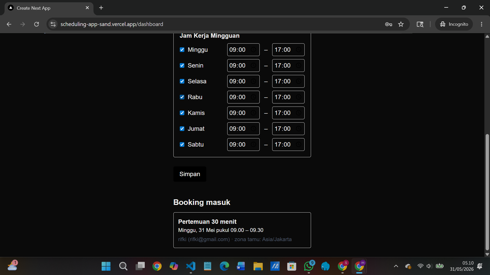
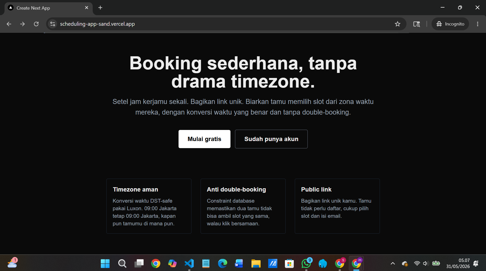
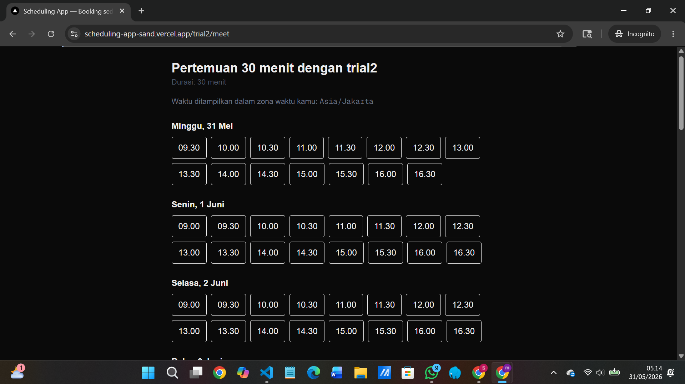

# Scheduling SaaS

A self-hosted scheduling platform inspired by Calendly. Hosts set their weekly availability, and guests book a 30-minute slot through a public link — with correct timezone conversion and atomic double-booking protection.

🔗 **Live demo:** [scheduling-app-sand.vercel.app](https://scheduling-app-sand.vercel.app)


### Landing


### Host dashboard


### Public booking page


## Why this project

I built this to practice the parts of full-stack development that are usually skipped in tutorials: **time zones, DST, race conditions, and pure-function design that can actually be tested.**

## Features

- Email + password authentication (Auth.js v5, JWT sessions)
- Host dashboard: set weekly working hours per day
- Public booking page at `/{username}/{event-slug}`
- Slot generation respects host's working hours, slot duration, existing bookings, and minimum notice
- Guest can book from any timezone — times are rendered locally
- Confirmed bookings prevent double-booking at the database level
- Host sees upcoming bookings on their dashboard

## Tech stack

| Layer | Choice |
|---|---|
| Framework | Next.js 16 (App Router, Server Actions) |
| Language | TypeScript |
| Database | PostgreSQL on Neon |
| ORM | Prisma 7 (with `@prisma/adapter-pg`) |
| Auth | Auth.js v5 (Credentials + JWT, no adapter) |
| Time | Luxon (DST-safe) |
| Validation | Zod |
| Styling | Tailwind CSS |
| Tests | Vitest |
| Hosting | Vercel (serverless) |

## Architecture highlights

### Two kinds of time
Recurring availability is stored as wall-clock minutes-from-midnight (`Int`) in the host's local timezone. Booked slots are stored as UTC `DateTime`. This separation means a host moving from Jakarta to Berlin doesn't have their schedule silently shift.

### DST-safe slot generation
When projecting a rule like "09:00 every Monday" onto a calendar day, the engine uses Luxon's `.set({ hour, minute })` instead of `midnight + 9*60 minutes`. This correctly handles "spring forward" and "fall back" — verified with unit tests for both EST (Feb) and EDT (Jul) in New York.

### Race-condition-safe booking
Two guests clicking the same slot at the same time is handled at the database level via `@@unique([userId, startTime])`. Postgres atomically rejects the second insert with error `P2002`, which the booking action translates into a user-facing "slot just taken" message.

### Pure availability engine
`getAvailableSlots()` is a pure function: it takes rules, existing bookings, the range, and a `now` parameter — no database access inside. All edge cases (booking conflicts, past-slot filtering, DST) are covered by Vitest tests that run in milliseconds.

## Local setup

```bash
git clone https://github.com/BANYUss/scheduling-app
cd scheduling-app
npm install
cp .env.example .env
# fill in DATABASE_URL and AUTH_SECRET in .env
npx prisma migrate deploy
npm run dev
```

App runs at `http://localhost:3000`.

## Environment variables

| Variable | Description |
|---|---|
| `DATABASE_URL` | PostgreSQL connection string. For serverless deployments use Neon's pooled URL (`-pooler` in hostname). |
| `AUTH_SECRET` | Random 32-byte base64 string. Generate with `node -e "console.log(require('crypto').randomBytes(32).toString('base64'))"`. |
| `AUTH_TRUST_HOST` | Set to `true` when deploying behind a reverse proxy (required on Vercel). |

## Running tests

```bash
npm test
```

5 tests cover the availability engine: basic slot generation, booking conflicts, past-slot filtering, and DST transitions (winter + summer).

## Deployment

Deployed on Vercel with auto-deploy from `main`. Notes:
- Add a `postinstall: "prisma generate"` script so the Prisma Client is generated during Vercel's build step.
- On Vercel, set the three environment variables above (`AUTH_TRUST_HOST=true` is required for Auth.js v5).
- Use Neon's **pooled** connection URL — direct connections exhaust quickly under serverless load.

## Author

**Sahrul Arif Fauzi**  
GitHub: [@BANYUss](https://github.com/BANYUss)